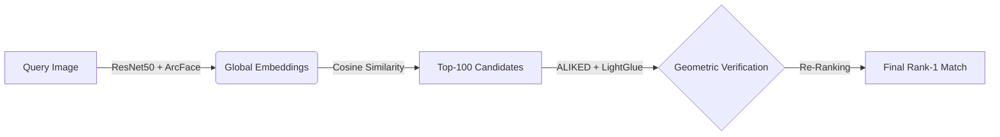

# Hybrid Geometric Re-Identification for Wildlife

A two-stage computer vision pipeline for individual animal re-identification (Re-ID). This project combines the speed of Deep Metric Learning (ArcFace) with the precision of Geometric Verification (LightGlue) to robustly identify animals in challenging environments and from a variety of unique viewpoints where features of an individual can vary greatly.

## Overview

Identifying individual animals (e.g., "Zebra A" vs. "Zebra B") is critical for conservation but difficult due to similar coat patterns and extreme pose variations. Standard Convolutional Neural Networks (CNNs) often overfit to background noise.

**Our Solution:**
1.  **Global Retrieval (Coarse):** A **ResNet-50** backbone trained with **ArcFace Loss** scans the database and retrieves the Top-100 most similar candidates based on embedding vectors.
2.  **Geometric Verification (Fine):** **LightGlue**, a deep feature matcher, analyzes the Top-100 candidates. It ignores the background and looks for consistent geometric patterns (keypoints) on the animal's body to re-rank the list.

## The Pipeline

## Setup Environment
# Create a new environment (optional but recommended)
conda create -n reid_env python=3.10
conda activate reid_env

# Install Python dependencies
pip install -r requirements.txt

## Code Walkthrough

This pipeline is divided into three sequential steps. All source code is located in the src/ folder.

- Step 1: Train the Global Retriever (ArcFace)

    First, we train the ResNet-50 backbone to learn identity-discriminating features.

    Script: src/train_arcface.py

    Input: The unified wildlife dataset (images sorted by folder/ID).

    Output: A trained model file (e.g., resnet50_arcface.pth).

    # Run training (adjust batch size in script if needed for your GPU)
    python src/train_arcface.py

- Step 2: Generate Top-100 Candidates

    Once the model is trained, we use it to scan the dataset and find the top 100 most likely matches for every query image using Cosine Similarity.

    Script: src/generate_candidates.py

    Input: The trained .pth model and the test dataset.

    Output: candidates_top100.json (A large file containing lists of potential matches).

    # Generate the candidate list
    python src/generate_candidates.py

- Step 3: Geometric Re-Ranking (LightGlue)

    Finally, we refine the results. This script takes the Top-100 list and checks each pair using LightGlue to verify geometric consistency.

    Script: src/rerank_lightglue.py

    Input: candidates_top100.json

    Output: final_results.json and printed accuracy metrics (Rank-1, Rank-5).

    # Run feature matching with LightGlue
    python src/rerank_lightglue.py

## Results

We evaluated this pipeline on the WildlifeReID-10k dataset (~140k images). The hybrid approach significantly outperforms the standard global embedding baseline.

Method                          Rank-1 Accuracy     Rank-5 Accuracy
Baseline (ArcFace)              56.81%              66.87%
Hybrid (ArcFace + LightGlue)    61.97%              68.81%

## Credits

This projects was competed by both Connor Kannally and Sal Hargis as part of an exploration of individual re-identification at The Ohio State University. This project was advised and guided by Dr. Wei-Lun (Harry) Chao, Associate Professor at The Ohio State University. 